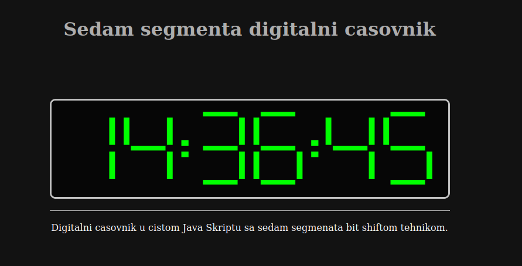

# Seven segments digital clock

Inspired by [Daniel Shiffman](https://github.com/shiffman) Sevent Segments Display [challenge](https://thecodingtrain.com/CodingChallenges/117-seven-segment.html) in P5.JS

I made this in pure JavaScript just for fun, with p5.js library is much easy.

